# Teaching-HEIGVD-SRX-2022-Laboratoire-Firewall

**Travail à réaliser en équipes de deux personnes.**

**ATTENTION : Commencez par créer un Fork de ce repo et travaillez sur votre fork.**

Clonez le repo sur votre machine. Vous retrouverez notamment dans ce repo les ficher `Dockerfile` et `docker-compose.yml` indispensables pour l'ajout des conteneurs et configuration du réseau.

Vous pouvez répondre aux questions en modifiant directement votre clone du README.md ou avec un fichier pdf que vous pourrez uploader sur votre fork.

**Le rendu consiste simplement à compléter toutes les parties marquées avec la mention "LIVRABLE". Le rendu doit se faire par une "pull request". Envoyer également le hash du dernier commit et votre username GitHub par email au professeur et à l'assistant**

## Table de matières

[Introduction](#introduction)

[Echéance](#echéance)

[Topologie](#topologie)

[Adressage](#plan-dadressage)

[Cahier des charges du réseau](#cahier-des-charges-du-réseau)

[Regles de filtrage](#regles-de-filtrage)

[Installation de l’environnement virtualisé](#installation-de-lenvironnement-virtualisé)

[Tests des connections et exemple de l'application d'une règle](#tests-des-connections-et-exemple-de-lapplication-dune-règle)

[Règles pour le protocole DNS](#règles-pour-le-protocole-dns)

[Règles pour les protocoles HTTP et HTTPS](#règles-pour-les-protocoles-http-et-https)

[Règles pour le protocole ssh](#règles-pour-le-protocole-ssh)

[Règles finales](#règles-finales)

## Introduction

L’objectif principal de ce laboratoire est de familiariser les étudiants avec les pares-feu et en particulier avec `netfilter` et `nftables`, le successeur du vénérable `iptables`.
En premier, une partie théorique permet d’approfondir la rédaction de règles de filtrage.

Par la suite, la mise en pratique d’un pare-feu permettra d’approfondir la configuration et l’utilisation d’un pare-feu ainsi que la compréhension des règles.

La [documentation nftables](https://wiki.nftables.org/wiki-nftables/index.php/Main_Page) est très complète. Vous en aurez besoin pour réaliser ce laboratoire et pour répondre à certaines questions.

La documentation contient aussi un excellent résumé pour "[apprendre nftables en 10 minutes](https://wiki.nftables.org/wiki-nftables/index.php/Quick_reference-nftables_in_10_minutes)" qui peut vous être utile.

## Auteurs

Ce texte se réfère au laboratoire « Pare-feu » à suivre dans le cadre du cours Sécurité des Réseaux, 2022, version 8.0.  Au cours du temps, il a été rédigé, modifié et amélioré par les co-auteurs suivants : Gilles-Etienne Vallat, Alexandre Délez, Olivia Manz, Patrick Mast, Christian Buchs, Sylvain Pasini, Vincent Pezzi, Yohan Martini, Ioana Carlson, Abraham Rubinstein et Frédéric Saam.

## Echéance

Ce travail devra être rendu le dimanche après la fin de la 2ème séance de laboratoire, soit au plus tard, **le 18 Mars 2022, à 23h59.**

# Réseaux cible

## Topologie

Durant ce laboratoire, nous allons utiliser une seule topologie réseau :

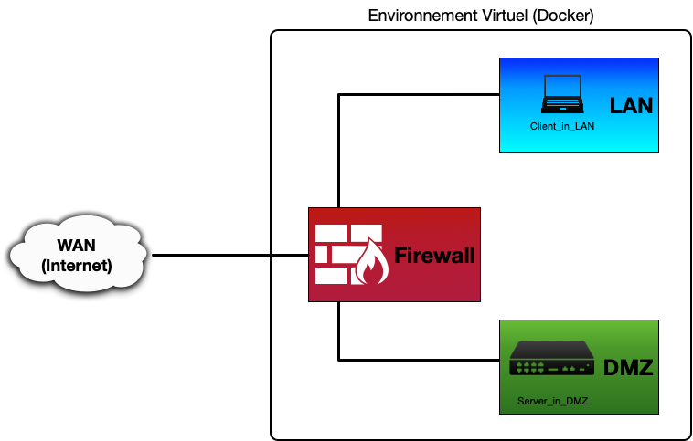

Notre réseau local (LAN) sera connecté à Internet (WAN) au travers d’un pare-feu. Nous placerons un serveur Web en zone démilitarisée (DMZ).

Par conséquent, nous distinguons clairement trois sous-réseaux :

- Internet (WAN), le réseau de l'école ou votre propre réseau servira de WAN,
- le réseau local (LAN),
- la zone démilitarisée (DMZ).

Ce réseau sera créé de manière virtuelle. Il sera simulé sur un seul ordinateur utilisant trois conteneurs Docker basés sur le système d’exploitation Ubuntu :

- La première machine, Firewall, fait office de pare-feu. Elle comporte trois interfaces réseaux. Afin que ce poste puisse servir de pare-feu dans notre réseau, nftables sera utilisé.
- La seconde machine, Client\_In\_LAN, fait office de client dans le réseau local (LAN).
- La dernière machine, Server\_In\_DMZ, fait office de serveur Web en (DMZ).

Nous allons utiliser les trois interfaces réseaux de la machine Firewall afin de pouvoir connecter le LAN et la DMZ à Internet (WAN). Les machines Client\_In\_LAN et Server\_In\_DMZ comportent chacune une interfaces réseau eth0.

## Plan d'adressage

Afin de bien spécifier le réseau, il est nécessaire d’avoir un plan d'adressage précis. C'est la liste des réseaux que vous utiliserez, comprenant pour chaque interface l'adresse IP ainsi que le masque de sous-réseau.
Pour ce laboratoire, nous vous imposons le plan d’adressage suivant :

- Le réseau "LAN" &rarr; 192.168.100.0/24
- Le réseau "DMZ" &rarr; 192.168.200.0/24
- Le réseau "WAN" sera défini par le NAT interne du réseau Docker

Les adresses IP sont définies dans le schéma ci-dessous :

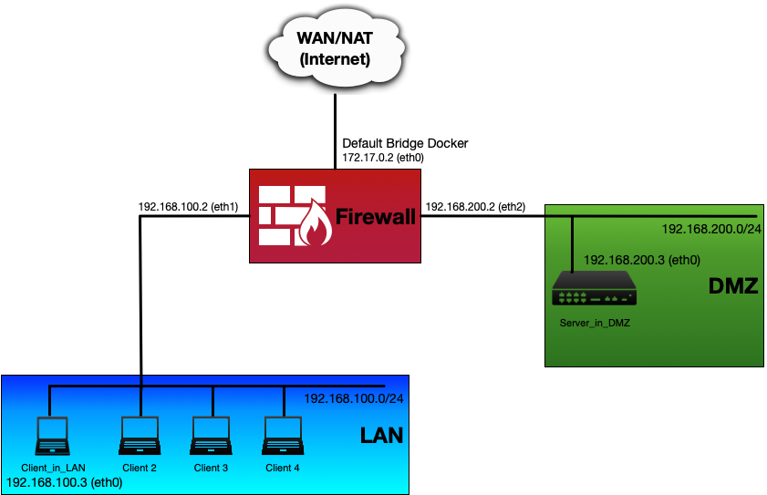

## Cahier des charges du réseau

Avant de configurer les règles, il est primordial de connaître les besoins de notre réseau. Ceci afin de laisser passer les flux légitimes lors de la rédaction des règles.

Le but du **LAN** est de fournir aux utilisateurs de votre réseau un accès à Internet ; à certains services de base uniquement en empêchant les connexions provenant de l'extérieur. Il faudra tout de même laisser entrer les paquets répondants aux requêtes de notre LAN. Une seule machine est présente sur ce réseau. Il s’agit de la machine dont le nom est **Client\_In\_LAN**. (il est très facile de rajouter de machines supplémentaires sur le LAN utilisant Docker).

La **DMZ** est un réseau réservé aux serveurs que l'on veut rendre accessibles depuis l'extérieur et l’intérieur de notre réseau. Par exemple, si nous voulons publier un site web que l'on héberge, il faut accepter des connexions sur le serveur web; dans ce cas, nous ne pouvons pas le placer dans le LAN, cela constituerait un risque. Nous accepterons donc les connexions entrantes dans la DMZ, mais seulement pour les services que l'on désire offrir. Le serveur Web situé dans la DMZ est simulé par la machine **Server\_In\_DMZ**.

Le **WAN** n'est que l'accès à Internet. Il est connecté au réseau de l'école ou à votre propre à travers le système de réseau fourni par Docker.

Pour établir la table de filtrage, voici les **conditions à respecter** dans le cadre de ce laboratoire :

1.	Les **serveurs DNS** utilisés par les postes dans le LAN sont situés sur le WAN. Les services DNS utilisent les ports UDP 53 et TCP 53.
2.	Laisser passer les **PING** uniquement du LAN au WAN, du LAN à la DMZ et de la DMZ au LAN pour les tests. Le ping utilise le protocole ICMP (echo request et echo reply).
3.	Les clients du **LAN** doivent pouvoir ouvrir des connexions HTTP pour accéder au web. Le protocole HTTP utilise les ports TCP 80 et typiquement aussi le 8080.
4.	Les clients du **LAN** doivent pouvoir ouvrir des connexions HTTPS pour accéder au web. Le protocole HTTPS utilise le port TCP 443.
5.	Le serveur **web en DMZ** doit être atteignable par le WAN et le LAN et n'utilise que le port 80.
6.	Le serveur de la DMZ peut être commandé à distance par **ssh** depuis votre client du LAN **uniquement**. Le service ssh utilise le port TCP 22.
7.	Le firewall peut être configuré à distance par **ssh** depuis votre client du LAN **uniquement**.
8.	**Toute autre action est par défaut interdite**.

# Regles de filtrage

<ol type="a" start="1">
  <li>En suivant la méthodologie vue en classe, établir la table de filtrage avec précision en spécifiant la source et la destination, le type de trafic (TCP/UDP/ICMP/any), les ports sources et destinations ainsi que l'action désirée (<b>Accept</b> ou <b>Drop</b>, éventuellement <b>Reject</b>).
  </li>                                  
</ol>

_Pour l'autorisation d'accès (**Accept**), il s'agit d'être le plus précis possible lors de la définition de la source et la destination : si l'accès ne concerne qu'une seule machine (ou un groupe), il faut préciser son adresse IP ou son nom (si vous ne pouvez pas encore la déterminer), et non la zone.
Appliquer le principe inverse (être le plus large possible) lorsqu'il faut refuser (**Drop**) une connexion._

_Lors de la définition d'une zone, spécifier l'adresse du sous-réseau IP avec son masque (par exemple, "/24" correspond à 255.255.255.0) ou l'interface réseau (par exemple : "interface WAN") si l'adresse du sous-réseau ne peut pas être déterminé avec précision._

---

**LIVRABLE : Remplir le tableau**

| Adresse IP source | Adresse IP destination | Type | Port src | Port dst | Action | Commentaire |
| :---:             | :---:                  | :---:| :------: | :------: | :----: | :---------- |
| *                 | *                      | *    | *        | *        | DROP   | Bloque tout par défaut |
| 192.168.100.0/24  | *                      | UDP  | *        | 53       | ACCEPT | DNS LAN -> WAN |
| 192.168.100.0/24  | *                      | TCP  | *        | 53       | ACCEPT | DNS LAN -> WAN |
| 192.168.100.0/24  | *                      | ICMP | *        | *        | ACCEPT | PING LAN -> * |
| 192.168.200.0/24  | 192.168.100.0/24       | ICMP | *        | *        | ACCEPT | PING DMZ -> LAN |
| 192.168.100.0/24  | *                      | TCP  | *        | 80       | ACCEPT | HTTP LAN -> * |
| 192.168.100.0/24  | *                      | TCP  | *        | 8080     | ACCEPT | HTTP LAN -> * |
| 192.168.100.0/24  | *                      | TCP  | *        | 443      | ACCEPT | HTTPS LAN -> * |
| *                 | 192.168.200.0/24       | TCP  | *        | 80       | ACCEPT | HTTP * -> DMZ |
| 192.168.100.0/24  | 192.168.200.0/24       | TCP  | *        | 22       | ACCEPT | SSH LAN -> DMZ |
| 192.168.100.0/24  | 192.168.100.2          | TCP  | *        | 22       | ACCEPT | SSH LAN -> FW |
|                   |                        |      |          |          |        |

* Les réponses sont autorisées en entrées lorsqu'elles ont un lien avec une
  requête sortant ou font partie d'une connexion établie.(RELATED, ESTABLISHED)

---

# Installation de l’environnement virtualisé

Ce chapitre indique comment installer l'environnement. Il se base sur des outils gratuits, téléchargeables sur Internet.

## Matériel
Il est possible d’utiliser les mêmes instructions sur une version de Windows ou un système Linux ou Mac OS X.

Afin d'installer les différents logiciels présentés ici, il faut disposer d’un ordinateur (avec les droits administrateur).

## Installation de Docker
Docker est un logiciel permettant de créer des conteneurs virtuels afin de simuler diverses configurations. Nous l'utiliserons pour exécuter les trois machines dont nous aurons besoin pour ce laboratoire. L’installation de Docker ne comporte pas de difficulté particulière. Une installation « par défaut » suffira. Il est possible d’utiliser une version que vous avez déjà installée ou une version téléchargée, mais la documentation pour ce laboratoire a été testée avec la version 3.2.2 de Docker Desktop pour Mac. Si vous rencontrez des problèmes, une mise à jour de Docker es peut-être la solution.

Vous pouvez trouver Docker pour Windows et Mac OS [ici](https://www.docker.com/products/docker-desktop).

Pour Linux, referez-vous au gestionnaire de paquets de votre distribution.

## Installation de Git

Vous avez probablement déjà installé Git pour d’autres cours ou projets. Si ce n’est pas le cas, vous pouvez prendre la bonne version pour votre OS [ici](https://git-scm.com/download/).


## Démarrage de l'environnement virtuel

### Ce laboratoire utilise docker-compose, un outil pour la gestion d'applications utilisant multiples conteneurs. Il va se charger de créer les réseaux `lan` et `dmz`, la machine Firewall, un serveur dans le réseau DMZ et une machine dans le réseau LAN et de tout interconnecter correctement.

Nous allons commencer par lancer docker-compose. Il suffit de taper la commande suivante dans le répertoire racine du labo (celui qui contient le fichier `docker-compose.yml`:

```bash
docker-compose up --detach
```
Le téléchargement et génération d'images prend peu de temps.

Vous pouvez vérifier que les réseaux ont été créés avec la commande `docker network ls`. Un réseau `lan` et un réseau `dmz` devraient se trouver dans la liste.

Les images utilisées pour les conteneurs sont basées sur l'image officielle Ubuntu. Le fichier `Dockerfile` que vous avez téléchargé contient les informations nécessaires pour la génération de l'image de base. `docker-compose` l'utilise comme un modèle pour générer les conteneurs. Vous pouvez vérifier que les trois conteneurs sont crées et qu'ils fonctionnent à l'aide de la commande suivante.

```bash
docker ps
```

## Communication avec les conteneurs et configuration du firewall

Afin de simplifier vos manipulations, les conteneurs ont été configurées avec les noms suivants :

- Firewall
- Client\_in\_LAN
- Server\_in\_DMZ

Pour accéder au terminal de l’une des machines, il suffit de taper :

```bash
docker exec -it <nom_de_la_machine> /bin/bash
```

Par exemple, pour ouvrir un terminal sur votre firewall :

```bash
docker exec -it Firewall /bin/bash
```

Vous pouvez bien évidemment lancer des terminaux avec les trois machines en même temps !


## Configuration de base

La plupart de paramètres sont déjà configurés correctement sur les trois machines. Il est pourtant nécessaire de rajouter quelques commandes afin de configurer correctement le réseau pour le labo.

Vous pouvez commencer par vérifier que le ping n'est pas possible actuellement entre les machines. Depuis votre Client\_in\_LAN, essayez de faire un ping sur le Server\_in\_DMZ (cela ne devrait pas fonctionner !) :

```bash
ping 192.168.200.3
```
---

**LIVRABLE : capture d'écran de votre tentative de ping.**  

---

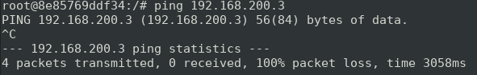

En effet, la communication entre les clients dans le LAN et les serveurs dans la DMZ doit passer à travers le Firewall. Dans certaines configurations, il est probable que le ping arrive à passer par le bridge par défaut. Ceci est une limitation de Docker. **Si votre ping passe**, vous pouvez accompagner votre capture du ping avec une capture d'une commande traceroute qui montre que le ping ne passe pas actuellement par le Firewall mais qu'il a emprunté un autre chemin.

Il faut donc définir le Firewall comme passerelle par défaut pour le client dans le LAN et le serveur dans la DMZ.

### Configuration du client LAN

Dans un terminal de votre client, taper les commandes suivantes :

```bash
ip route del default
ip route add default via 192.168.100.2
```

### Configuration du serveur dans la DMZ

Dans un terminal de votre serveur dans DMZ, taper les commandes suivantes :

```bash
ip route del default
ip route add default via 192.168.200.2

service nginx start
service ssh start
```

Les deux dernières commandes démarrent les services Web et SSH du serveur.

La communication devrait maintenant être possible entre les deux machines à travers le Firewall. Faites un nouveau test de ping, cette fois-ci depuis le serveur vers le client :

```bash
ping 192.168.100.3
```

---

**LIVRABLES : captures d'écran des routes des deux machines et de votre nouvelle tentative de ping.**

---

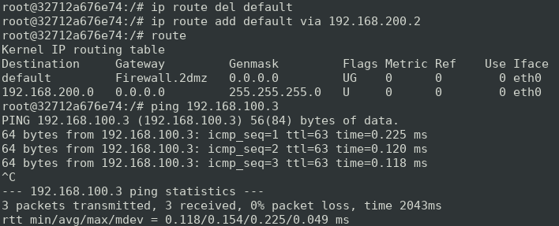

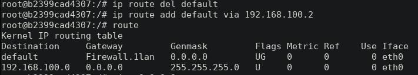

La communication est maintenant possible entre les deux machines. Pourtant, si vous essayez de communiquer depuis le client ou le serveur vers l'Internet, ça ne devrait pas encore fonctionner sans une manipulation supplémentaire au niveau du firewall ou sans un service de redirection ICMP. Vous pouvez le vérifier avec un ping depuis le client ou le serveur vers une adresse Internet.

Par exemple :

```bash
ping 8.8.8.8
```

Si votre ping passe mais que la réponse contient un _Redirect Host_, ceci indique que votre ping est passé grâce à la redirection ICMP, mais que vous n'arrivez pas encore à contacter l'Internet à travers le Firewall. Ceci est donc aussi valable pour l'instant et accepté comme résultat.

---

**LIVRABLE : capture d'écran de votre ping vers l'Internet. Un ping qui ne passe pas ou des réponses contenant des _Redirect Host_ sont acceptés.**

---
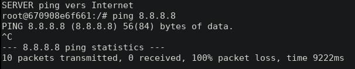
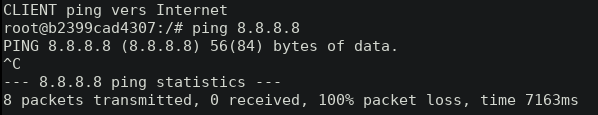

### Configuration réseau du firewall

On va fournir une route vers l'internet à travers le firewall aux deux réseaux connectés. Pour cela, on va se servir des premières commandes `nftables` :

```bash
nft add table nat
nft 'add chain nat postrouting { type nat hook postrouting priority 100 ; }'
nft add rule nat postrouting meta oifname "eth0" masquerade
```

La dernière commande `nftables` définit une règle dans le tableau NAT qui permet la redirection de ports et donc, l'accès à l'Internet pour les deux autres machines à travers l'interface eth0 qui est connectée au WAN.


<ol type="a" start="2">
  <li>Quelle est l'utilité de la première commande ?
  </li>                                  
</ol>

---

**Réponse :** 

*Ajoute une nouvelle table appelée "nat". Une table dans nft est un ensemble de
chaînes, règles et autre objets qui va permettre de filtrer une famille, qui
correspond à un type type d'adresse tel que ipv4, ipv6, nat, arp, etc.*

---

<ol type="a" start="3">
  <li>Quelle est l'utilité de la deuxième commande ? Expliquer chacun des paramètres.
  </li>                                  
</ol>

---

**Réponse :**

*Crée une nouvelle chaine nomée "postrouting" pour la table "nat". 
Le paramètre type permet de spécifier s'il s'agit d'une route, 
d'un filtre ou d'un nat. dans notre cas, il s'agit d'un nat.* 

*Le paramètre "hook" permet de déterminer de quelle manière les paquets 
doivent être traîtés par le kernel. Dans notre cas, nous les traîtons 
comme des paquets "ip" en après le routage. Les autres options aurait été 
de traîter les paquets comme "arp", "bridge" ou "netdev".* 

TODO, correction:
* Le paramètre "hook" indique à quel étape du traitement le paquet doit être
  traité par cette règle. Il est possible de traiter un paquet juste après avoir
  été traité par le driver de la carte réseau (ingress), avant le routing
  (prerouting), à destination du système local (input), a destination d'autres
  système (forward), dont l'origine est le système local mais à destination d'un
  système extérieur (output) ainsi que après que le routing ait été effectué
  (postrouting).

*Le paramètre "priority" permet d'ordonner les chaines en fonction de leur 
opération. Dans notre cas, la priorité 100 est appliquée, car il s'agît 
d'un nat en postrouting.*

TODO, correction:
* Le paramètre "priority" permet d'assigner une priorité aux règles afin
  qu'elles soient appliquées dans un certain ordre. La priorité avec la valeur
  la plus basse sera executée en première.

---


Cette autre commande démarre le service SSH du serveur :

```bash
service ssh start
```

Vérifiez que la connexion à l'Internet est maintenant possible depuis les deux autres machines ou qu'elle n'utilise plus de reditection. Pas besoin de capture d'écran mais assurez vous que les pings passent sans besoin de redirection de host avant de continuer.

Note: Nous avons validé le fonctionnement des pings depuis le client ainsi que
le serveur à destination de 8.8.8.8.


# Manipulations

## Création de règles

Une règle permet d’autoriser ou d’interdire une connexion. `nftables` met à disposition plusieurs options pour la création de ces règles. En particulier, on peut définir les politiques par défaut, des règles de filtrage pour le firewall ou des fonctionnalités de translation d’adresses (nat). **Vous devriez configurer vos politiques en premier.**

`nftables` vous permet la configuration de pare-feux avec et sans état. **Pour ce laboratoire, vous avez le choix d'utiliser le mode avec état, sans état ou une combinaison des deux**.

Chaque règle doit être tapée sur une ligne séparée. Référez-vous à la théorie et appuyez-vous sur des informations trouvées sur Internet pour traduire votre tableau de règles de filtrage en commandes `nftables`. Les règles prennent effet immédiatement après avoir appuyé sur &lt;enter>\. Vous pouvez donc les tester au fur et à mesure que vous les configurez.


## Sauvegarde et récupération des règles

**Important** : Les règles de filtrage définies avec `nftables` ne sont pas persistantes (par défaut, elles sont perdues après chaque redémarrage de la machine firewall). Il existe pourtant de manières de sauvegarder votre config.

<ol type="a" start="4">
  <li>Faire une recherche et expliquer une méthode de rendre la config de votre firewall persistente.
  </li>                                  
</ol>

---

**Réponse :**
mehdi:
Pour sauvegarder:
nft list ruleset > nftables.conf
Pour restaurer:
nft -f nftables.conf

Pour que le fichier soit chargé à chaque démarrage de la machine, le mettre 
dans(pour Debian):
/etc/nftables.conf

Guilain:
Copier les règles dans le fichier nftables.conf dans etc/ 
(effacer ce qui s'y trouvait, en particulier le flush rulset)

---


&rarr; Note : Puisque vous travaillez depuis un terminal natif de votre machin hôte, vous pouvez facilement copier/coller les règles dans un fichier local. Vous pouvez ensuite les utiliser pour reconfigurer votre firewall en cas de besoin.


<ol type="a" start="5">
  <li>Quelle commande affiche toutes les règles de filtrage en vigueur ?
  </li>                                  
</ol>

---

**Réponse :**

Mehdi:

nft list ruleset

---


<ol type="a" start="6">
  <li>Quelle commande est utilisée pour effacer toutes les règles de filtrage en vigueur ?
  </li>                                  
</ol>

---

**Réponse :**

Mehdi:

Pour tout effacer:

nft flush ruleset

---


<ol type="a" start="7">
  <li>Quelle commande est utilisée pour effacer les chaines ?
  </li>                                  
</ol>

---

**Réponse :**

Mehdi:

nft delete chain <nom_table> <nom_chain> 

Egalement pour effacer uniquement une règle:
Afficher le numéro de règle (handle) avec:
nft list ruleset -a
puis effacer la règle voulue:
nft delete rule <nom_table> <nom_chain> handle <numero_handle>

---


---

## Tests des connections et exemple de l'application d'une règle

Pour chaque manipulation, il est important de **garder les règles déjà créées**, les nouvelles sont ajoutées aux existantes.

Pour commencer sur une base fonctionnelle, nous allons configurer le pare-feu pour accepter le **ping** dans certains cas. Cela va permettre de tester la connectivité du réseau.

Le but est de configurer les règles pour que le pare-feu accepte
-	les ping depuis le LAN sur les machines de la DMZ,
-	les ping depuis le LAN sur le WAN,
-	les ping depuis la DMZ vers le LAN.

Ceci correspond a la **condition 2** du cahier des charges.

Commandes nftables :

---

```bash
LIVRABLE : Commandes nftables
```

---

Mehdi:
ping LAN -> DMZ:
ping LAN -> WAN:
ping DMZ -> LAN:

```
table ip filter {
	chain INPUT {
		type filter hook input priority filter; policy drop;
		ct state established,related accept
		
		# allows ping LAN -> FW
		ip saddr 192.168.100.0/24 ip daddr 192.168.100.2 icmp type echo-request accept

		# allows ping DMZ -> FW
		ip saddr 192.168.200.0/24 ip daddr 192.168.200.2 icmp type echo-request accept
		
	}

	chain FORWARD {
		type filter hook forward priority filter; policy drop;

		# allows ping LAN -> DMZ
		ip saddr 192.168.100.0/24 ip daddr 192.168.200.0/24 icmp type echo-request accept
		ct state established,related accept

		# allows ping DMZ -> LAN
		ip saddr 192.168.200.0/24 ip daddr 192.168.100.0/24 icmp type echo-request accept

		# allows ping LAN -> WAN
		ip saddr 192.168.100.0/24 oifname "eth0" icmp type echo-request accept

	}

	chain OUTPUT {
		type filter hook output priority filter; policy drop;
		ct state established,related accept
	}
}


```
Guilain: 
```
chain INPUT { # handle 4
    type filter hook input priority filter; policy accept;
    ip saddr 192.168.100.0/24 ip daddr 192.168.100.2 tcp dport 22 accept # handle 19
    drop # handle 31
}

chain OUTPUT { # handle 5
    type filter hook output priority filter; policy accept;
    drop # handle 30
}

chain FORWARD { # handle 8
    type filter hook forward priority filter; policy accept;
    ip saddr 192.168.100.0/24 udp dport 53 accept # handle 10
    ip saddr 192.168.100.0/24 tcp dport 53 accept # handle 11
    ip saddr 192.168.100.0/24 icmp type { echo-reply, echo-request } accept # handle 12
    ip daddr 192.168.100.0/24 icmp type echo-reply accept # handle 25
    ip saddr 192.168.200.0/24 ip daddr 192.168.100.0/24 icmp type { echo-reply, echo-request } accept # handle 13
    ip saddr 192.168.100.0/24 tcp dport 80 accept # handle 14
    ip saddr 192.168.100.0/24 tcp dport 8080 accept # handle 15
    ip saddr 192.168.100.0/24 tcp dport 443 accept # handle 16
    ip daddr 192.168.100.0/24 tcp flags ack accept # handle 28
    ip daddr 192.168.200.0/24 tcp dport 80 accept # handle 17
    ip saddr 192.168.200.0/24 tcp flags ack accept # handle 29
    ip saddr 192.168.100.0/24 ip daddr 192.168.200.0/24 tcp dport 22 accept # handle 18
    drop # handle 21
}

```

### Questions

<ol type="a" start="8">
  <li>Afin de tester la connexion entre le client (Client_in_LAN) et le WAN, tapez la commande suivante depuis le client :
  </li>                                  
</ol>

```bash
ping 8.8.8.8
``` 	            
Faire une capture du ping.

Vérifiez aussi la route entre votre client et le service `8.8.8.8`. Elle devrait partir de votre client et traverser votre Firewall :

```bash
traceroute 8.8.8.8
``` 	            

```
---
**LIVRABLE : capture d'écran du traceroute et de votre ping vers l'Internet. Il ne devrait pas y avoir des _Redirect Host_ dans les réponses au ping !**

---

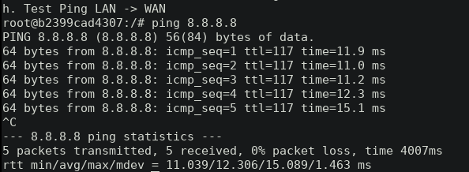

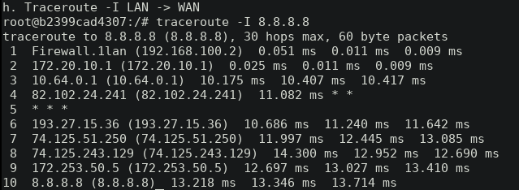

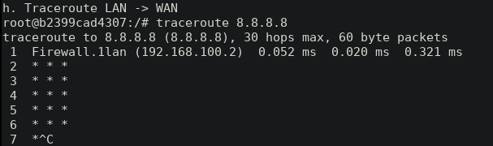

Note à propos de traceroute: 
La commande traceroute 8.8.8.8 n'arrive pas à determiner les différents
intermédiaires et retourne des lignes comportant des * au lieu de mettre les ip
des machines. Après quelques recherches, nous avons trouvé que traceroute
utilise des paquets UDP par défaut, quine sont pas autorisé par notre firewall.
Une alternative consiste à utiliser 'traceroute -I 8.8.8.8' qui utilise  le
protocol ICMP. La commande fonctionne alors car ICMP est autorisé

```
<ol type="a" start="9">
  <li>Testez ensuite toutes les règles, depuis le Client_in_LAN puis depuis le serveur Web (Server_in_DMZ) et remplir le tableau suivant :
  </li>                                  
</ol>

Mehdi: 
| De Client\_in\_LAN à | OK/KO | Commentaires et explications |
| :---                 | :---: | :---                         |
| Interface DMZ du FW  | KO    | Client pas autorisé à ping interface DMZ du FW
| Interface LAN du FW  | OK    | Client autorisé à ping interface LAN du FW |
| Client LAN           | ??    | A tester avec un 2eme client |
| Serveur WAN          | OK    | Autorisé dans forward        |


| De Server\_in\_DMZ à | OK/KO | Commentaires et explications |
| :---                 | :---: | :---                         |
| Interface DMZ du FW  | OK    | Autorisé dans INPUT          |
| Interface LAN du FW  | KO    | Pas autorisé                 |
| Serveur DMZ          | ??    | A tester avec autre serv     |
| Serveur WAN          | KO    | Pas autorisé                 |


## Règles pour le protocole DNS

<ol type="a" start="10">
  <li>Si un ping est effectué sur un serveur externe en utilisant en argument un nom DNS, le client ne pourra pas le résoudre. Le démontrer à l'aide d'une capture, par exemple avec la commande suivante :
  </li>                                  
</ol>

```bash
ping www.google.com
```

* Faire une capture du ping.

---

**LIVRABLE : capture d'écran de votre ping.**

---

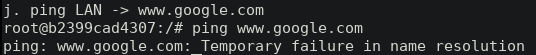

* Créer et appliquer la règle adéquate pour que la **condition 1 du cahier des charges** soit respectée.

Commandes nftables :

---

```bash
LIVRABLE : Commandes nftables
```
```
Mehdi:
nft add rule filter FORWARD ip saddr 192.168.100.0/24 tcp dport 53 accept
nft add rule filter FORWARD ip saddr 192.168.100.0/24 udp dport 53 accept
```

---

<ol type="a" start="11">
  <li>Tester en réitérant la commande ping sur le serveur de test (Google ou autre) :
  </li>                                  
</ol>

---

**LIVRABLE : capture d'écran de votre ping.**

---


<ol type="a" start="12">
  <li>Remarques (sur le message du premier ping)?
  </li>                                  
</ol>

---
**Réponse**

**LIVRABLE : Votre réponse ici...**
Mehdi:
Lorsque l'on tente d'atteindre une adresse telle que www.google.com, le système doit d'abord
résoudre le nom pour obtenir son adresse ip. Avant d'autoriser les requêtes à 
destination du port 53 en TCP et UDP, on peut
constater qu'il y a un échec de résolution de nom. 


---


## Règles pour les protocoles HTTP et HTTPS

Créer et appliquer les règles adéquates pour que les **conditions 3 et 4 du cahier des charges** soient respectées. Tester que les règles soient fonctionnelles en utilisant wget depuis le Client\_in\_LAN pour télécharger une ressource depuis un site Web de votre choix (sur le WAN). Par exemple :

```bash
wget http://www.heig-vd.ch
```

* Créer et appliquer les règles adéquates avec des commandes nftables.

Commandes nftables :

---

```bash
LIVRABLE : Commandes nftables
```

---

* Créer et appliquer les règles adéquates avec des commandes nftables pour que la **condition 5 du cahier des charges** soit respectée.

Commandes nftables :
Mehdi:
nft add rule filter FORWARD ip saddr 192.168.100.0/24 tcp dport 80 accept
nft add rule filter FORWARD ip saddr 192.168.100.0/24 tcp dport 8080 accept
nft add rule filter FORWARD ip saddr 192.168.100.0/24 tcp dport 443 accept

---

```bash
LIVRABLE : Commandes nftables
```
---

<ol type="a" start="13">
  <li>Tester l’accès à ce serveur depuis le LAN utilisant utilisant wget (ne pas oublier les captures d'écran).
  </li>                                  
</ol>

---

**LIVRABLE : capture d'écran.**

---

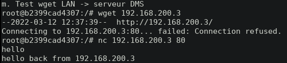

Note: wget ne fonctionne pas car il n'y a pas de serveur à
l'écoute sur le port 80. Nous avons réalisé un test en mettant netcat sur écoute
sur le port 80 du serveur dans la DMZ puis en tentant une connexion depuis le
client en LAN. La connexion a pu être effectuée, validant ainsi notre règle.


## Règles pour le protocole ssh

<ol type="a" start="14">
  <li>Créer et appliquer la règle adéquate pour que les <b>conditions 6 et 7 du cahier des charges</b> soient respectées.
  </li>                                  
</ol>

Commandes nftables :

---

```bash
LIVRABLE : Commandes nftables
```

---

Depuis le client dans le LAN, tester l’accès avec la commande suivante :

```bash
ssh root@192.168.200.3
```

---

**LIVRABLE : capture d'écran de votre connexion ssh.**

---


<ol type="a" start="15">
  <li>Expliquer l'utilité de <b>ssh</b> sur un serveur.
  </li>                                  
</ol>

---
**Réponse**

**LIVRABLE : Votre réponse ici...**

SSH permet de contrôler des machines à distance et ce de manière sécurisée grâce
au chiffrement et une gestion de clés privées / publiques. SSH généralement
utilisée pour accéder au terminal sur une machine distante, mais permet
également de créer un tunnel dans lequel faire passer d'autres protocol de
manière sécurisée.

---

<ol type="a" start="16">
  <li>En général, à quoi faut-il particulièrement faire attention lors de l'écriture des règles du pare-feu pour ce type de connexion ?
  </li>                                  
</ol>


---
**Réponse**

**LIVRABLE : Votre réponse ici...**

SSH étant un protocole énormément utilisé, il y a constemment des attaques sur
le port 22 des machines exposées à internet. Lorsque cela est possible, il est
donc préférable de resteindre l'accès au port 22 au réseau interne d'une
entreprises ou à quelques machines choisies afin de limiter les attaques.

---

## Règles finales

A présent, vous devriez avoir le matériel nécessaire afin de reproduire la table de filtrage que vous avez conçue au début de ce laboratoire.

<ol type="a" start="17">
  <li>Insérer la capture d’écran avec toutes vos règles nftables
  </li>                                  
</ol>

---

**LIVRABLE : capture d'écran avec toutes vos règles.**

---

Mehdi:

```
table ip nat {
	chain PREROUTING {
		type nat hook prerouting priority dstnat; policy accept;
	}

	chain INPUT {
		type nat hook input priority 100; policy accept;
	}

	chain POSTROUTING {
		type nat hook postrouting priority srcnat; policy accept;
		ip daddr 127.0.0.11 counter packets 0 bytes 0 jump DOCKER_POSTROUTING
	}

	chain OUTPUT {
		type nat hook output priority -100; policy accept;
		ip daddr 127.0.0.11 counter packets 0 bytes 0 jump DOCKER_OUTPUT
	}

	chain DOCKER_OUTPUT {
		ip daddr 127.0.0.11 tcp dport 53 counter packets 0 bytes 0 dnat to 127.0.0.11:36509
		ip daddr 127.0.0.11 udp dport 53 counter packets 0 bytes 0 dnat to 127.0.0.11:58033
	}

	chain DOCKER_POSTROUTING {
		ip saddr 127.0.0.11 tcp sport 36509 counter packets 0 bytes 0 snat to :53
		ip saddr 127.0.0.11 udp sport 58033 counter packets 0 bytes 0 snat to :53
	}

	chain postrouting {
		type nat hook postrouting priority srcnat; policy accept;
		oifname "eth0" masquerade
	}
}
table ip filter {
	chain INPUT {
		type filter hook input priority filter; policy drop;
		ct state established,related accept

        # allows ping LAN -> FW
		ip saddr 192.168.100.0/24 ip daddr 192.168.100.2 icmp type echo-request accept

        # allows ping DMZ -> FW
		ip saddr 192.168.200.0/24 ip daddr 192.168.200.2 icmp type echo-request accept
        
        # allows ssh LAN -> FW
		ip saddr 192.168.100.0/24 ip daddr 192.168.100.2 tcp dport 22 accept
	}

	chain FORWARD {
		type filter hook forward priority filter; policy drop;
		ct state established,related accept

        # allows ping LAN -> DMZ
		ip saddr 192.168.100.0/24 ip daddr 192.168.200.0/24 icmp type echo-request accept

        # allows ping DMZ -> LAN
		ip saddr 192.168.200.0/24 ip daddr 192.168.100.0/24 icmp type echo-request accept

        # allows ping LAN -> WAN
		ip saddr 192.168.100.0/24 oifname "eth0" icmp type echo-request accept
        
        # allows DNS LAN -> WAN
		ip saddr 192.168.100.0/24 tcp dport 53 accept
		ip saddr 192.168.100.0/24 udp dport 53 accept

        # allows HTTP, HTTPS LAN -> WAN
		ip saddr 192.168.100.0/24 oifname "eth0" tcp dport 80 accept
		ip saddr 192.168.100.0/24 oifname "eth0" tcp dport 8080 accept
		ip saddr 192.168.100.0/24 oifname "eth0" tcp dport 443 accept

        # allows HTTP WAN -> web serv in DMZ
		iifname "eth0" ip daddr 192.168.200.3 tcp dport 80 accept

        # allows HTTP LAN -> web serv in DMZ
		ip saddr 192.168.100.0/24 ip daddr 192.168.200.3 tcp dport 80 accept

        # allows SSH LAN -> web serv in DMZ
		ip saddr 192.168.100.0/24 ip daddr 192.168.200.3 tcp dport 22 accept
	}

	chain OUTPUT {
		type filter hook output priority filter; policy drop;
		ct state established,related accept
	}
}
```
